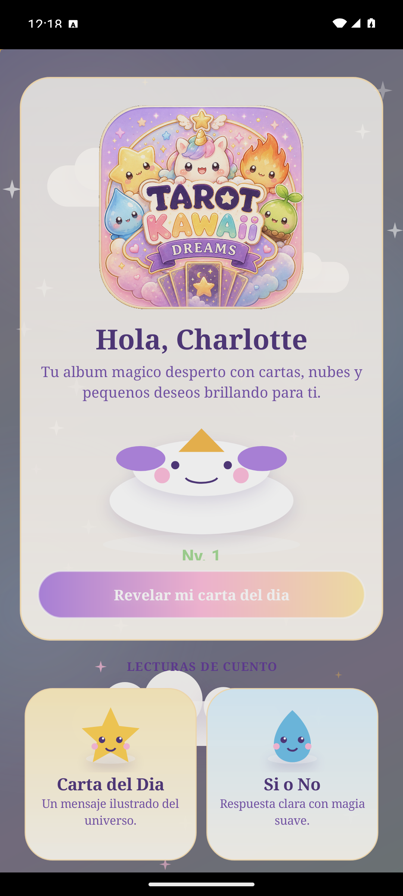
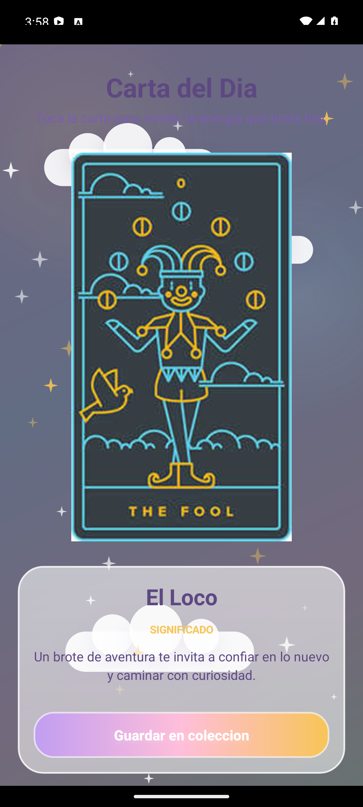
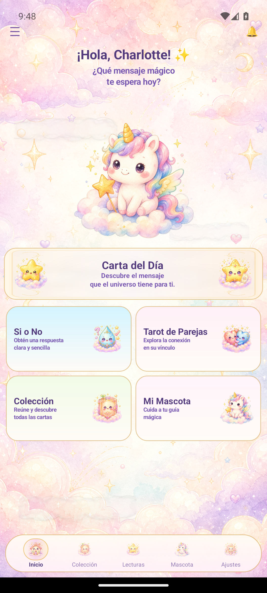
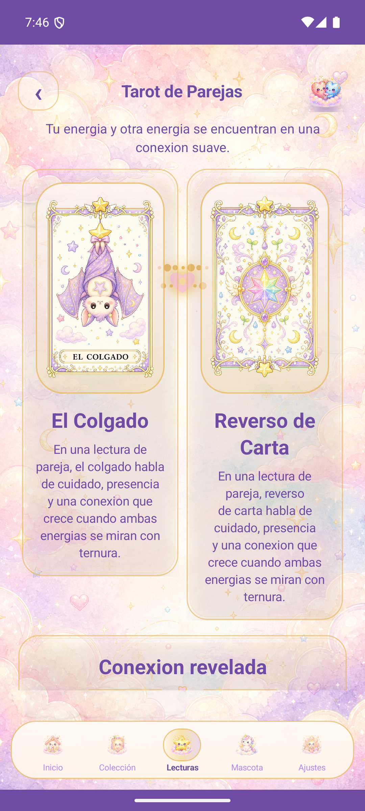

# Tarot Kawaii Dreams

Tarot Kawaii Dreams es una aplicación Android nativa de tarot ilustrado con estética de cuento mágico, papelería japonesa y acuarela pastel. La experiencia gira alrededor de cartas coleccionables, lecturas suaves y una interfaz visualmente cercana a un álbum mágico.

La app está construida en Java con vistas personalizadas. Usa las cartas reales del proyecto desde `assets/tarot_cards` y carga la información de cada carta desde Firebase Realtime Database.

## Capturas Actuales

| Inicio | Carta del Día |
| --- | --- |
|  |  |

| Sí o No | Tarot de Parejas |
| --- | --- |
|  |  |

| Colección | Ajustes |
| --- | --- |
|  |  |

## Experiencia

- Home con fondo pastel, logo, saludo, escena mágica decorativa, accesos principales y navegación inferior.
- Carta del Día con carta cerrada, revelación al tocar, resultado e interpretación.
- Sí o No con gotita kawaii, consulta, respuesta y explicación.
- Tarot de Parejas con dos cartas grandes, conexión visual e interpretación conjunta.
- Colección con categorías, progreso, cartas desbloqueadas y cartas bloqueadas con estilo de álbum.
- Detalle de carta con carta grande, familia, significado, lectura invertida y acciones.

## Dirección Visual

La interfaz busca sentirse como un libro ilustrado premium:

- lavanda pastel
- rosa suave
- azul acuarela
- verde brote
- dorado cálido
- crema luminoso

Los elementos decorativos se dibujan con vistas custom para evitar placeholders o iconos Android genéricos: nubes, estrellas, reversos de carta, partículas, cartas bloqueadas y navegación inferior.

## Tecnologías

- Android nativo
- Java
- Gradle
- Firebase Realtime Database
- AndroidX AppCompat
- Vistas custom en Canvas

## Estructura Principal

```text
app/
  src/main/java/com/example/evaluacion4charlottegabriel/
    MainActivity.java
    CartaDelDia.java
    SiYNo.java
    tarotPareja.java
    CollectionActivity.java
    CardDetailActivity.java
    SettingsActivity.java
    Dao/
      Carta.java
      DaoCarta.java
      FirebaseTarotDatabase.java
    ui/
      DreamBackground.java
      DreamBottomNav.java
      DreamButton.java
      TarotScaffold.java
      AnimatedRevealCard.java
      TarotCardWidget.java
      CollectionCard.java
      CardBackView.java
      MagicSceneView.java
      TarotBackDrawable.java
assets/
  tarot_cards/
docs/
  screenshots/
```

## Compilación

Desde la raíz del proyecto:

```powershell
.\gradlew.bat assembleDebug
```

La APK debug se genera en:

```text
app/build/outputs/apk/debug/app-debug.apk
```

## Autores

Charlotte Rodríguez y Gabriel Barrientos.
