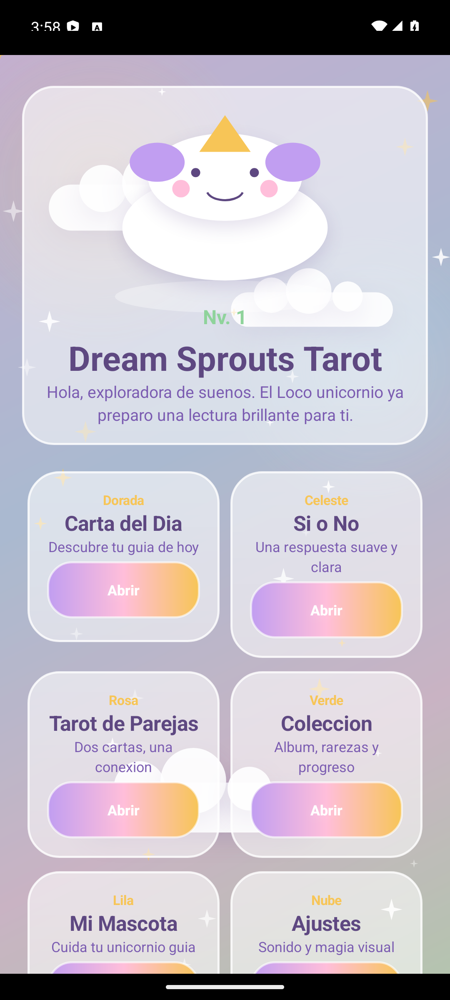
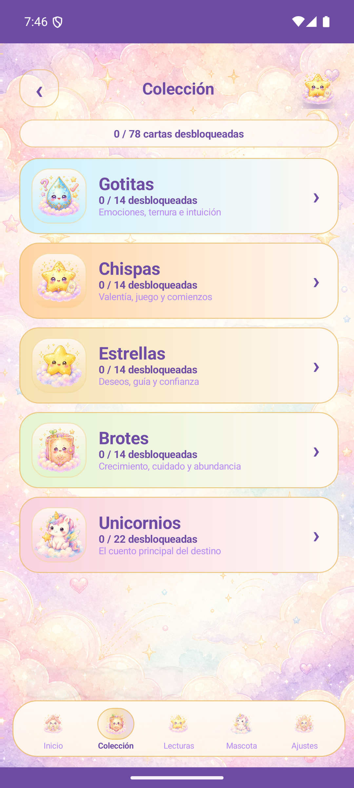
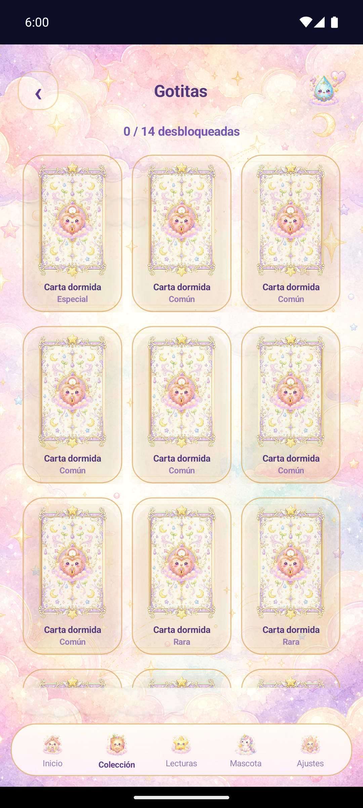
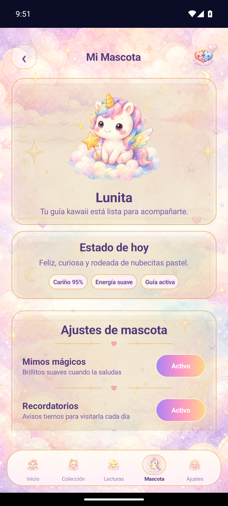
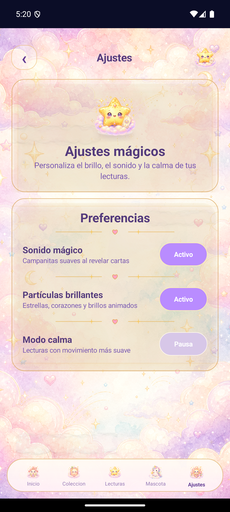
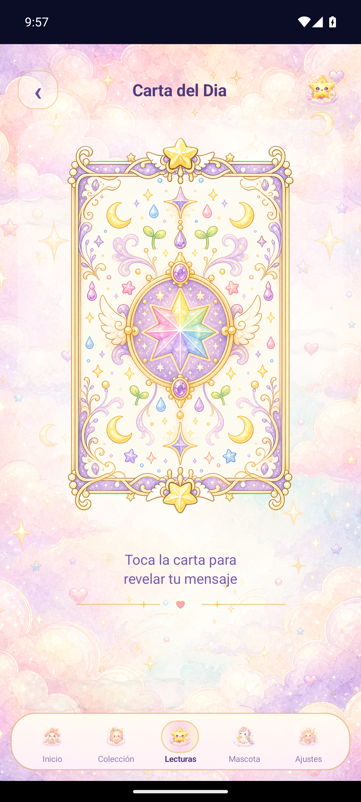

# Tarot Kawaii Dreams

Tarot Kawaii Dreams es una app Android nativa de tarot ilustrado con estetica kawaii, acuarela pastel y contenedores tipo album magico. La experiencia combina lectura diaria, consultas rapidas, coleccion de familias y una mascota guia.

La app esta construida en Java con vistas personalizadas. Usa las cartas reales del proyecto desde `assets/tarot_cards` y mantiene la navegacion principal con bottom nav.

## Capturas Actuales

| Inicio | Coleccion |
| --- | --- |
|  |  |

| Gotitas | Mascota |
| --- | --- |
|  |  |

| Ajustes | Carta del Dia |
| --- | --- |
|  |  |

## Flujo Principal

- Inicio muestra saludo, unicornio hero, Carta del Dia y accesos a Si o No, Tarot de Parejas, Coleccion y Mascota.
- Coleccion abre primero un indice de familias: Gotitas, Chispas, Estrellas, Brotes y Unicornios.
- Al tocar una familia, se abre su album con grid de cartas desbloqueadas y cartas dormidas.
- Carta del Dia presenta una carta cerrada que se revela al tocar.
- Si o No abre una lectura rapida desde la card del Home.
- Mascota y Ajustes usan el mismo sistema visual de paneles pastel.

## Sistema Visual

Los contenedores comparten un lenguaje visual comun:

- fondos crema, blanco rosado o pastel suave
- borde dorado fino
- esquinas redondeadas
- sombra suave
- texto morado elegante
- subtitulos lila
- iconos kawaii acuarela
- bottom nav tipo pildora, legible y con item activo

## Estructura Principal

```text
app/
  src/main/java/com/example/evaluacion4charlottegabriel/
    MainActivity.java
    CartaDelDia.java
    SiYNo.java
    tarotPareja.java
    CollectionActivity.java
    CardDetailActivity.java
    MascotaActivity.java
    SettingsActivity.java
    TarotNavigator.java
    Dao/
    ui/
      DreamBackground.java
      DreamBottomNav.java
      DreamPanelDrawable.java
      TarotScaffold.java
      CollectionCard.java
      TarotCardWidget.java
assets/
  tarot_cards/
docs/
  screenshots/
```

## Compilacion

Desde la raiz del proyecto:

```powershell
.\gradlew.bat assembleDebug
```

La APK debug se genera en:

```text
app/build/outputs/apk/debug/app-debug.apk
```

## Notas

- No se generan assets por codigo: las ilustraciones vienen de los recursos existentes.
- La pantalla Coleccion siempre inicia en el indice de familias.
- Las pantallas de familia conservan el fondo acuarela y el bottom nav consistente.

## Autores

Charlotte Rodriguez y Gabriel Barrientos.
